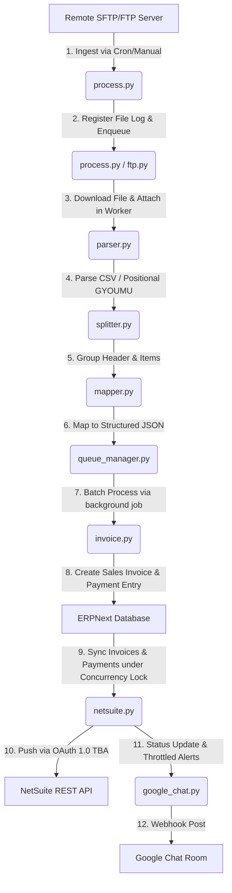

# Teraoka Integration App Documentation

The **Teraoka Integration** (`teraoka_integration`) is a custom ERPNext application that automates POS transaction data ingestion from Teraoka machines. It handles remote file downloading, parsing, transactional chunking, local ERPNext record creation (Sales Invoices & Payments), and subsequent synchronization to NetSuite via REST APIs, complete with real-time logging and Google Chat webhook notifications.

---

## 🏗️ Architecture Overview

The integration follows a structured pipeline:

---

## 🚀 Key Integration Features

The app implements several robust, enterprise-grade capabilities to ensure high reliability and rate management:

1. **Automatic Payment & Invoice Retry**: 
   A background cron job periodically scans for failed NetSuite sync logs and attempts to re-push them, ensuring orphaned payments are synchronized only after their parent invoices are successfully created.
2. **Concurrent File Downloads & Processing**: 
   FTP/SFTP file downloading and database log registrations are decoupled from the main cron thread. Ingestion is scheduled as separate, non-blocking background workers (`frappe.enqueue`) running in parallel.
3. **NetSuite Concurrency & Rate Limiting**: 
   A Redis-based distributed lock (`netsuite_api_concurrency_lock`) with an adjustable timeout (120s) and API throttling prevents concurrent NetSuite request clashes (avoiding HTTP `429 Too Many Requests` responses).
4. **Alert Fatigue & Webhook Throttling**: 
   Google Chat webhook alerts use a Redis-based 4-hour cooldown lock per file log to prevent flooding the notification channels during retries or sync iterations.
5. **Direct Form Sync Retry**: 
   The `NetSuite Sync Log` form includes a **Retry Sync** button for administrators, enabling manual re-sync execution directly from the failed log view.

---

## 📂 DocTypes Description

The app defines five key DocTypes to manage configuration, transactional mappings, and audit logging:

### 1. [Teraoka Settings](file:///opt/bench/frappe-bench/apps/teraoka_integration/teraoka_integration/teraoka_integration/doctype/teraoka_settings/teraoka_settings.json) (Single DocType)
* **Purpose**: Serves as the central configuration panel for the application.
* **Key Fields**:
  * **Connection Settings**: `host`, `port`, `is_sftp` (Check), `username`, `password`, `remote_path`, `archive_processed_files` (Check), `archive_path`.
  * **Shop Mappings Table**: Child table links to `Teraoka Shop Mapping Details`.
  * **Global Defaults**: `company`, `customer` (default Walk-In customer), `default_warehouse`, `default_cash_account`.
  * **Automation Settings**: `enabled` (Sync master switch), `auto_submit` (automatically submit generated invoices).
  * **Item Master Defaults**: `default_item_group` (used to automatically register missing items).
  * **NetSuite Integration Settings**: `netsuite_enabled` (Check), `netsuite_customer_id`, `netsuite_account_id`, `netsuite_rest_url`, consumer keys/secrets, token IDs/secrets, and `google_chat_webhook_url`.

### 2. [Teraoka Shop Mapping Details](file:///opt/bench/frappe-bench/apps/teraoka_integration/teraoka_integration/teraoka_integration/doctype/teraoka_shop_mapping_details/teraoka_shop_mapping_details.json) (Table DocType)
* **Purpose**: Acts as a mapping table to link shop codes extracted from POS files to ERPNext and NetSuite dimensions.
* **Key Fields**:
  * `shop_code`: The unique identifier in POS filenames or data headers (e.g. `SHOP01`, `001`).
  * `warehouse`: The target ERPNext warehouse.
  * `company`: The target ERPNext company.
  * `cost_center`: The cost center for the transaction.
  * `netsuite_location_id`: Corresponding location internal ID in NetSuite.

### 3. [Teraoka File Log](file:///opt/bench/frappe-bench/apps/teraoka_integration/teraoka_integration/teraoka_integration/doctype/teraoka_file_log/teraoka_file_log.json) (Standard DocType)
* **Purpose**: Tracks every file fetched from the remote server, maintaining details on its execution history, statistics, and sync outcomes.
* **Key Fields**:
  * `filename`: The remote filename.
  * `status`: Ingestion phase (`Pending`, `Pending Sync`, `Syncing`, `Success`, `Partial Success`, `Failed`).
  * `processed_on`: Date and time of processing.
  * `attached_file`: Copy of the POS CSV/pos file saved in private files.
  * `total_quantity`, `total_amount`: Aggregated sales metrics (MIS Analytics).
  * `shop_code`, `file_date`: Extracted shop code and transaction date.
  * `success_count`, `error_count`, `total_records`: Execution statistics.
  * `transaction_details`: Table of individual transaction records mapping to child rows.
  * `logs`: Detailed debug stack traces and error output.
  * `google_chat_error`: Records webhook notification failures.

### 4. [Teraoka File Log Detail](file:///opt/bench/frappe-bench/apps/teraoka_integration/teraoka_integration/teraoka_integration/doctype/teraoka_file_log_detail/teraoka_file_log_detail.json) (Table DocType)
* **Purpose**: A child table within `Teraoka File Log` containing status tracking for each transaction found in the file.
* **Key Fields**:
  * `transaction_id`: Composite key generated from `store_code_date_register_receipt`.
  * `doc_type`: The target ERPNext DocType (`Sales Invoice` or `Payment Entry`).
  * `doc_name`: Name of the created document in ERPNext.
  * `status`: Transaction status (`Success`, `Skipped`, `Failed`).
  * `error_message`: Captured exception messages if validation fails.

### 5. [NetSuite Sync Log](file:///opt/bench/frappe-bench/apps/teraoka_integration/teraoka_integration/teraoka_integration/doctype/netsuite_sync_log/netsuite_sync_log.json) (Standard DocType)
* **Purpose**: Stores detailed API request and response data for audits of the NetSuite integration layer. Supports user manual retries for failed records.
* **Key Fields**:
  * `document_type`, `document_name`: Links back to ERPNext Sales Invoice or Payment Entry.
  * `netsuite_id`: The ID returned by NetSuite on successful creation.
  * `status`: Sync status (`Success`, `Failed`).
  * `sync_time`: Exchanged timestamp.
  * `file_log`: Reference to parent `Teraoka File Log`.
  * `request_payload`: Raw JSON payload transmitted to NetSuite.
  * `response_data`: Raw JSON response returned by NetSuite.
* **Client Features**:
  * Form displays a **`Retry Sync`** button inside Gunicorn header if status is `Failed`. Runs a background API call that resyncs the invoice or payment entry directly and updates the audit log.

---

## 🛠️ Codebase Structure & File Documentation

### Hooks & Configuration
* [**`hooks.py`**](file:///opt/bench/frappe-bench/apps/teraoka_integration/teraoka_integration/hooks.py): 
  Defines app meta-information and registers cron schedules:
  * **Hourly Jobs**:
    * `sync_teraoka_files`: Checks SFTP server for new files and enqueues background processing.
    * `send_to_netsuite`: Syncs pending file log records to NetSuite.
    * `retry_failed_netsuite_syncs`: Attempts to re-push failed invoices and payment entries.
  * **Daily Jobs**:
    * `send_daily_sync_summary`: Sends summarized business metrics to Google Chat.

### Python Backend Services
All integration core operations reside under `teraoka_integration/services/`:

1. [**`api.py`**](file:///opt/bench/frappe-bench/apps/teraoka_integration/teraoka_integration/teraoka_integration/services/api.py):
   * Exposes a whitelisted method `test_connection(settings)` to validate credentials and path accessibility.

2. [**`ftp.py`**](file:///opt/bench/frappe-bench/apps/teraoka_integration/teraoka_integration/teraoka_integration/services/ftp.py):
   * Provides the `TeraokaConnector` context manager which dynamically wraps FTP (`ftplib`) or SFTP (`paramiko`) transports.
   * Exposes helpers: `list_files`, `download_file`, and `archive_file` (relocates processed files on the remote directory).

3. [**`parser.py`**](file:///opt/bench/frappe-bench/apps/teraoka_integration/teraoka_integration/teraoka_integration/services/parser.py):
   * Handles low-level parsing of files. Supports CP932 encoding (standard for Japanese shift-JIS POS formats) and UTF-8.
   * `parse_csv`: Reads file records. Detects header structure vs positional lines (`I3` / `IL`). Groups and aggregates records by Item Code to calculate total quantities, amounts, and weighted average rates.
   * `parse_raw_lines`: Reads raw rows as array splits to feed transaction splitting.
   * `clean_float`: Safely parses floats, removing currency symbols and malformed digits.

4. [**`splitter.py`**](file:///opt/bench/frappe-bench/apps/teraoka_integration/teraoka_integration/teraoka_integration/services/splitter.py):
   * `group_transactions`: Groups transactional records structurally. Scans lines, treating `TL` or `I1` records as headers, and nested `IL` or `I3` lines as constituent item lines.

5. [**`mapper.py`**](file:///opt/bench/frappe-bench/apps/teraoka_integration/teraoka_integration/teraoka_integration/services/mapper.py):
   * `map_transactions`: Maps grouped structural raw data into standardized JSON structures containing key dimensions: shop code, register number, receipt number, date, tax, customer, totals, and item details.

6. [**`queue_manager.py`**](file:///opt/bench/frappe-bench/apps/teraoka_integration/teraoka_integration/teraoka_integration/services/queue_manager.py):
   * `enqueue_transactions`: Enqueues transaction processing in batches of 50 via `frappe.enqueue` to stay within server timeout limits.
   * `process_single_transaction`: Executes the transaction import. Inserts a child `Teraoka File Log Detail` record and updates parent statistics dynamically. When all records finish, it moves the parent file log status to `Pending Sync`.

7. [**`invoice.py`**](file:///opt/bench/frappe-bench/apps/teraoka_integration/teraoka_integration/teraoka_integration/services/invoice.py):
   * Handles core ERPNext Sales Invoice and Payment Entry generation logic.
   * `create_sales_invoices` (Fallback/Legacy): Aggregates all transactions globally and creates general invoices chunked in 100-line batches. Auto-registers missing Item masters.
   * `create_sales_invoice_from_txn`: Takes a single structured POS transaction, checks for duplicates via `teraoka_receipt_key`, resolves the warehouse/cost center mapping, and creates a Sales Invoice. 
     * **Returns Support**: Automatically splits mixed transactions with positive and negative lines into separate Sales Invoices (applying normal returns formatting).
     * **Auto-payment**: If configuration dictates, calls `create_payment_entry` to close outstanding invoices immediately.
   * `create_payment_entry`: Creates a submitted `Payment Entry` document to close the invoice against the default cash account.

8. [**`netsuite.py`**](file:///opt/bench/frappe-bench/apps/teraoka_integration/teraoka_integration/teraoka_integration/services/netsuite.py):
   * Features `NetSuiteConnector`, which implements OAuth 1.0 Token-Based Authentication (TBA) with HMAC-SHA256 signature formatting.
   * **API Concurrency Locking**: Includes the `_request(self, method, url, **kwargs)` helper method that serializes all HTTP requests to NetSuite under a Redis-based distributed lock (`netsuite_api_concurrency_lock`) with a 120s timeout and a `0.2s` throttle between calls. This prevents concurrent request errors (HTTP 429).
   * `push_invoice` / `push_payment`: Prepares payloads and issues POST calls via `self._request`. Employs duplicate checks; if a record already exists, it queries NetSuite for the ID (`recover_record_id`) and updates the ERPNext record.
   * `get_item_internal_id`: Translates ERPNext Item codes or Barcodes to NetSuite Internal IDs using cache and NetSuite search queries (`/inventoryItem`). Caches results for 24 hours.
   * `sync_log_to_netsuite`: Background process mapping. Loops through Sales Invoices and Payment Entries from a `Teraoka File Log` batch, pushing them sequentially and updating progress. Triggers SFTP file archiving on success.
   * `retry_failed_netsuite_syncs`: Background cron job. Periodically scans for submitted `Sales Invoice` **and** `Payment Entry` documents that are missing a NetSuite ID from the last 48 hours, and retries their synchronization (verifying parent invoice link is set first).

9. [**`google_chat.py`**](file:///opt/bench/frappe-bench/apps/teraoka_integration/teraoka_integration/teraoka_integration/services/google_chat.py):
   * Sends Google Chat notifications using `cardsV2` layout.
   * **Alert Webhook Throttling**: Checks for a `google_chat_alert_cooldown:{log.name}` lock key in Redis before issuing a webhook. If successful, sets a 4-hour cooldown lock to prevent spam notifications during repeated cron cycles.
   * Parses JSON errors returned by NetSuite and ERPNext to supply clean human-readable briefings (`format_error_message`).
   * Sends daily telemetry summaries on files, revenues, and health checks.

10. [**`process.py`**](file:///opt/bench/frappe-bench/apps/teraoka_integration/teraoka_integration/teraoka_integration/services/process.py):
    * Scheduled/Manual entry point.
    * **Concurrent Background Ingestion**: Refactored to perform FTP/SFTP downloads and file attachment inside the enqueued worker thread (`process_file`) instead of blocking the main thread sequentially. The cron executes immediately by scheduling separate background tasks for each file to run in parallel.

---

## 🎨 UI & Dashboard Features

### 1. `Teraoka Hub` (Custom Page)
* **Path**: [`page/teraoka_hub/`](file:///opt/bench/frappe-bench/apps/teraoka_integration/teraoka_integration/teraoka_integration/page/teraoka_hub/)
* **Files**: `teraoka_hub.json`, `teraoka_hub.py`, `teraoka_hub.js`, `teraoka_hub.css`
* **Features**:
  * **Interactive Analytics**: Filters by date ranges and shops to show total sales, growth trends (compared to the previous period), and success rates.
  * **Ingestion Pipeline Flow Chart**: Visualizes live status updates (`active`, `success`, `error`, `pending`) for all integration stages (SFTP -> Parser -> Mapper -> Invoice -> NetSuite).
  * **Recent Ingest Logs**: Lists the 10 most recent ingestion logs.
  * **Action Center**: Prompts administrators with critical actions if errors are detected.
  * **Connectivity Diagnostics**: Provides one-click verification of FTP/SFTP connections and NetSuite auth paths.
  * **Control Board**: Enables manual sync execution and log reprocessing directly from the UI.

### 2. Workspace & Dashboard Widgets
* **Sidebar Integration**: The [`teraoka_pos.json`](file:///opt/bench/frappe-bench/apps/teraoka_integration/teraoka_integration/teraoka_integration/workspace/teraoka_pos/teraoka_pos.json) workspace provides standard menu links to the settings, logs, and custom hub.
* **Metrics Cards**:
  * `netsuite_failed_syncs`: Tracks failed pushes.
  * `teraoka_daily_sales`: Today's sales figures.
  * `teraoka_sync_health`: Aggregated health.
* **Charts**:
  * `teraoka_sales_by_shop`: Horizontal shop comparison chart.
  * `teraoka_sales_trend`: Cumulative daily revenue trends.

---

## 🧪 Testing Utilities

* [**`test_integration.py`**](file:///opt/bench/frappe-bench/apps/teraoka_integration/teraoka_integration/test_integration.py):
  * Useful for developers running command-line validation tests.
  * Exposes:
    * `wipe_integration_data()`: Clears logs, invoices, and payments to set up clean testing environments.
    * `execute()`: Simulates a synchronous file download, parse, map, and import sequence for dry runs.
    * `run_full_test()`: Seeds temporary mapping variables, triggers POS import, pushes to NetSuite, outputs structural details, and restores settings to original configurations automatically.
    * `run_teraoka_test_data()`: Manual runner for local/remote sync test of `teraoka_test_data.csv`.
    * `sync_test_log_to_netsuite()`: Syncs the current test run file log to NetSuite.

---

## 📞 Contact & Support

* **Developer**: Atharva Joshi
* **Email**: [atharva.joshi@ambibuzz.com](mailto:atharva.joshi@ambibuzz.com)
* **Company**: Ambibuzz Technologies LLP

---

## ⚖️ License & Copyright

© 2026 **Ambibuzz Technologies LLP**. All rights reserved.  
Licensed under the MIT License.